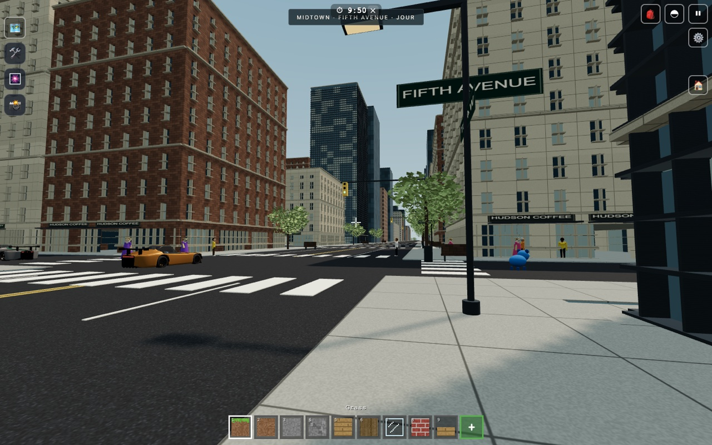
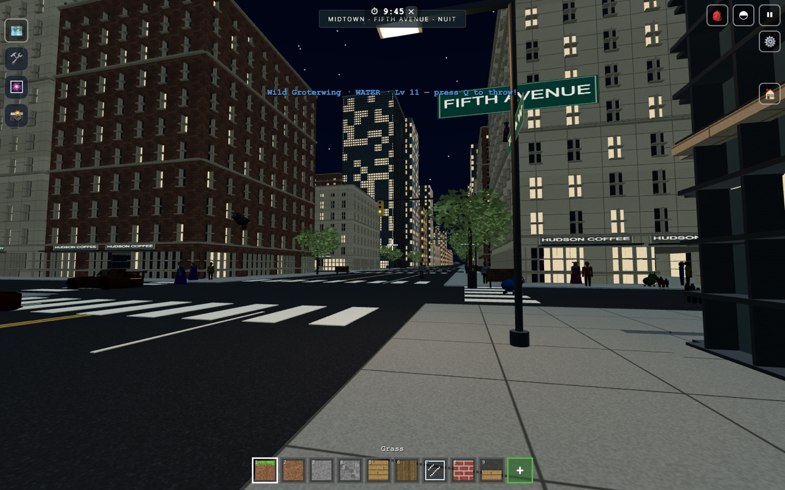
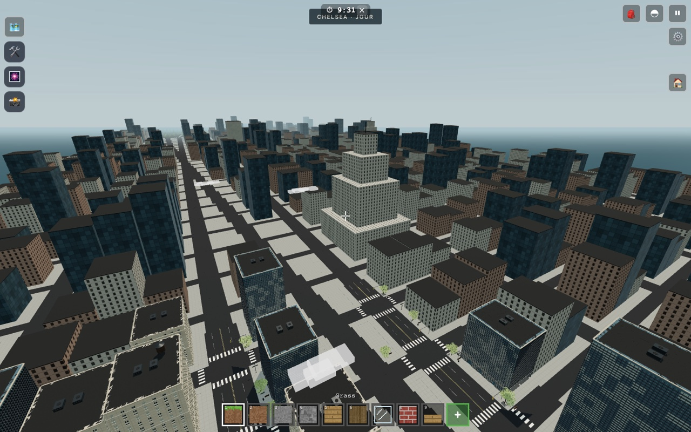
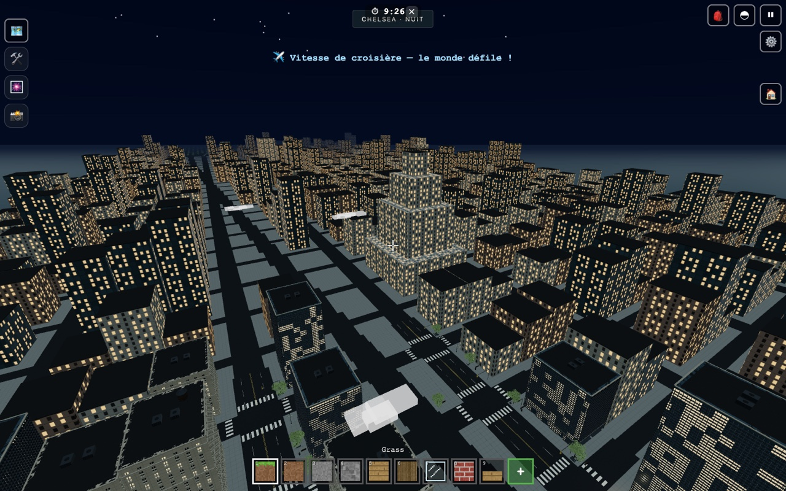

# Validation Manhattan — PR #226

Version de revue : cache PWA v239, intégrant `main` e06068b (v238).

## Résultat visuel et conditions

Le jeu a été lancé dans Chromium 151.0.7922.34 sur un **Apple M3 Pro** avec
ANGLE Metal. Les captures ordinateur mesurent 1 440 × 900 pixels. La tablette
est **émulée** à 1 024 × 768 CSS avec DPR plafonné à 1,25 ; ce n'est pas une
mesure sur iPad physique ni sous Safari iOS.

Le parcours d'entrée utilise les boutons visibles : profil, « Plus tard »
pour la proposition facultative de sécurisation, puis « Jouer en local ».
Le mode éducatif du jeu reste chargé et actif.

Onze captures ont été inspectées : Midtown au sol et en hauteur, jour/nuit,
Broadway, Central Park, Chrysler, retour après voyage, façade détruite,
excavation et tablette. **Zéro erreur JavaScript/WebGL** recueillie dans ce
parcours ; `getError()` renvoie 0 pour chaque point de mesure.

| Vue | Appels de dessin | Triangles | Images/s | Intervalle p95 |
| --- | ---: | ---: | ---: | ---: |
| Midtown au sol · jour | 671 | 3.19 M | 120.0 | 9.3 ms |
| Midtown au sol · nuit | 686 | 3.18 M | 119.9 | 9.5 ms |
| Skyline vers Midtown · jour | 415 | 2.23 M | 120.0 | 10.0 ms |
| Skyline vers Midtown · nuit | 416 | 2.23 M | 120.0 | 9.8 ms |
| Broadway et Times Square | 644 | 2.87 M | 119.9 | 9.9 ms |
| Central Park | 237 | 0.67 M | 120.0 | 9.7 ms |
| Chrysler Building | 518 | 3.43 M | 120.0 | 9.8 ms |
| Retour à Midtown après plusieurs quartiers | 679 | 3.53 M | 120.0 | 9.9 ms |
| Façade détruite : une ouverture praticable | 507 | 3.21 M | 120.0 | 9.9 ms |
| Excavation du trottoir et de la chaussée | 500 | 3.11 M | 120.0 | 9.7 ms |
| Profil tablette · interface tactile | 502 | 1.68 M | 120.0 | 9.3 ms |

Ce sont des mesures ponctuelles après chargement, sur cette machine. Elles
ne garantissent pas 120 images/s sur d'autres ordinateurs ou tablettes. La
construction progressive a été échantillonnée 710 fois :
p95 **5.7 ms**, maximum **14.9 ms** pour une tranche.
Le joystick tactile a parcouru **17.4 unités** en six secondes,
avec zéro erreur WebGL.

Le contrôle des captures a conduit à retirer un sol voxel dessiné en double,
à conserver le feuillage jusqu'au lointain et à allumer aussi les fenêtres
des silhouettes nocturnes. Les tampons de lots urbains sont libérés à la
sortie de portée. Le nombre global de géométries peut encore croître avec
les voitures et populations du jeu, dette déjà présente en v238 et suivie
dans `TASKS.md`.

## Captures de revue

| Vue | Jour | Nuit |
| --- | --- | --- |
| À hauteur de joueur |  |  |
| Skyline vers Midtown |  |  |

Copies de revue à 1 280 pixels de large ; les onze PNG complets accompagnent
la livraison locale.

## Régressions

Commande du portail : `cd tests && CHROMIUM_ANGLE=metal npm test`.

**Portail vert, code de sortie 0** : test de démarrage puis quatorze
suites validées. Le premier passage a exécuté toutes les suites ; après
correction du diagnostic VPN, le second passage a rejoué le démarrage,
`reseau.js`, `visio.js`, `hote.js` et `manhattan.js`. Le cache du portail a
réutilisé les dix autres verdicts après comparaison de leurs empreintes.
La reprise a pris environ huit minutes de suites et de pauses, en plus du
test de démarrage. Aucune source n’a été modifiée pendant les suites.

Les **24 témoins** du nouveau scénario Manhattan sont verts sur le code final :
isolation Terre/Manhattan, migration historique, éviction/rechargement,
collision, destruction de façade visible, pose, routes libres pour les
carrosseries, instancing, lumières, conduite au joystick, partage de lien,
quiz, pairs et avatars, sauvegarde cloud préfixée, même code sur deux cartes
et démarrage PWA hors ligne.

Le contrôle d'entrée de ce scénario a été exécuté sur un arbre isolé de
`main` e06068b : échec attendu « Manhattan ouvre le vrai jeu dans une carte
indépendante », code de sortie 1. Aucune empreinte historique de terrain
n'a été remplacée pour faire passer les tests. La suite `plafond.js` est
verte : 218 089 colonnes conservent l'empreinte `47fbedd47c47`, et les
4 040 colonnes de référence sous les constructions ne présentent aucun
déplacement. La maison sauvegardée reste intacte et sur son sol.

Le premier passage complet avait révélé un seul échec, le conseil VPN de
`reseau.js`. Le même parcours a reproduit le défaut sur `main` v238 et sur
la branche : la première tentative recevait des candidats de relais, puis
la reconnexion effaçait cette preuve à vingt secondes, juste avant le
verdict. Le correctif conserve la preuve pendant la session. Le parcours
ciblé renvoie alors le conseil attendu ; aucune assertion n’a été assouplie.

Les empreintes des fichiers du jeu et du banc ont été comparées entre les
captures et le portail final : seul `src/net.js` a changé, pour le diagnostic
décrit ci-dessus. Les fichiers du rendu et du gameplay Manhattan sont
identiques à ceux des captures.

## Portée de la validation

Les modèles et textures urbains sont générés dans le dépôt. Aucun asset de
GTA n'est utilisé. La flotte existante fournie par Max conserve son usage privé et familial,
non commercial ; elle n’est pas relicenciée par cette refonte. Les
bibliothèques tierces gardent leurs attributions. Les variantes de façade, les monuments et la géographie
restent interprétés et stylisés. Les personnages et créatures conservent
le style du jeu existant. Les reflets sont statiques, les intérieurs
sommaires et la circulation ne répond pas encore aux feux.

La vérification couvre le rendu Chromium, le cloud local de test et les
pairs locaux. Elle ne simule pas toutes les conditions réseau mobiles et
ne remplace pas un essai sur tablette physique. La PR reste à relire et à
valider visuellement avant fusion.
